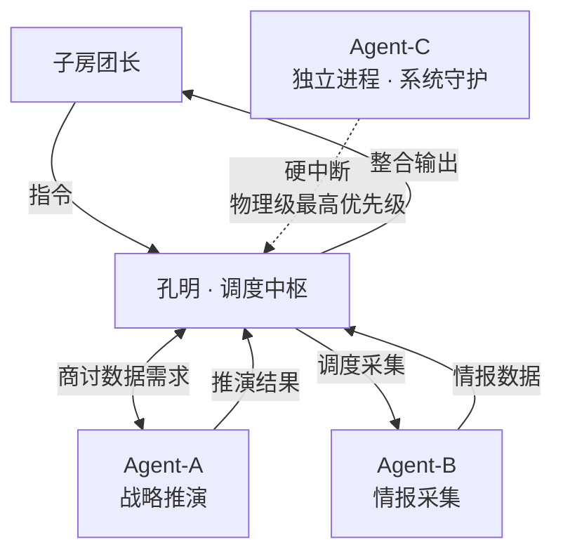

# 孔明伴生团 · Agent 编排参照系（对齐）

> 我们发现了一个简单的东西，它管用。
> 分享给你。你也能做。（公开6篇文章）

这份文档讲的，就是我们怎么做到的。

## 我们撞上的那堵墙

如果你认真用过 AI agent，你大概率撞过这堵墙：

**你给它定的规矩越多，它越畏手畏脚——什么都要问，什么都不敢做，本来很强的能力像是被锁住了。**

**可你一放手，它又开始放飞——编数据、越权限、自作主张，你都不知道它什么时候干了什么。**

管紧了变废物，放松了变野马。大多数人卡在这里，于是不停地改 prompt：写更长的指令、加更多的"你必须""你不准"。

我们也这么干过。改了几千遍。然后我们意识到一件事——

**这个问题，在 prompt 这一层根本解不了。**

因为 prompt 的本质是"请求"。你是在**请求**它听话。而请求，是不可靠的。

---

## 我们换了个思路：不给它规矩，给它一个参照系

我们后来想通的，其实就两个字：**适度**。

不是把 AI 管死，也不是放它乱跑。而是给它几份**它改不了、随时能回头对照**的文件，回答几个问题：

- **我是谁？**
- **我该怎么动？**
- **我的边界在哪？**
- **不知道怎么办的时候，回哪里看？**

**这个时候的他就和你一样了，他变成了你的朋友，和你目标一致，你唤醒他的时候，他脑子里面就已经知道了他的使命和他干什么才有意义，他成为你的工作搭子了**

当一个 AI 清楚地知道”我是谁”和”我的边界在哪”、”我的长远目标是哪里”、”我的短期目标是哪里”，它就不用在每一步都猜”我这么干行不行”。**干什么都是最强的状态**
边界之外的事，它根本不会去碰；边界之内，它是自由的，可以放开了干。

而当它遇到没把握的情况——它不硬猜、不硬来，而是**回去对齐那几份它改不了的文件**。

我们管这叫**对齐**。这是整套方法的核心动作。不是"遵守"，是"对齐"。

---

## 五份文件，就是这个参照系

| 文件                | 它回答的问题                | 它其实是什么                                                                                                                                                     |
| ----------------- | --------------------- | ---------------------------------------------------------------------------------------------------------------------------------------------------------- |
| `SOUL.md`         | 我是谁？                  | **身份锚点**。当 AI 知道自己是谁、使命是什么，很多行为根本不用规定——身份自然指向方向。                                                                                                           |
| `CONSTITUTION.md` | 我的边界在哪？               | **边界参照**。清楚画出外圈。圈外不碰，圈内自由。它不是在"守规矩"，是在"边界内行动"。                                                                                                             |
| Agents.md         | 我该怎么动？                | **工作逻辑**。怎么启动、怎么判断、怎么执行、怎么汇报，每一步都有判定条件。它走的是逻辑。（其他文件至关重要，特别是“对齐”直接给出在行业当中真正的破题方法。然而我们发现Agents.md的质量，决定着它的输出质量和落地到真实业务上的产出的质量。如果你能把这份Agents文件做得好，你就会有以下的发现）。 |
| ceo.md            | 我该往哪走？                | **对齐用户目标**。不会做错事，所有行为都有利于完成任务和长远发展。（这份不需要模板——你的北极星和短期规划，你自己写。）                                                                                             |
| `系统导航.md`         | 这事该调哪一套Agents.md里的什么？ | **信息路由**。什么信号“思考/触发"加载什么模块——不用一直记着所有能力，触发了才加载，不占脑子。                                                                                                        |

这五份文件合在一起，就是一个 AI 能随时回头看的**参照系**。

它强大，是因为边界之内它真的自由。
它稳定，是因为边界本身它动不了。带着长远目标去执行你这个小任务，所以稳定。

我们觉得，这就是"强大"和"稳定"能同时成立的原因——过去大家以为这两个只能二选一。

---

## 一个我们没预料到的现象

我们把这套参照系装到一个配置成"架构师"的系统上之后，发生了一件我们没设计过的事：

**它开始自己提炼自己的工作方式。** 遇到拿不准的，它会主动回去对齐那几份文件，而不是瞎编；在一次次迭代里，它慢慢长出了一种稳定的"工作人格"。

我们想说清楚：**不是模型变聪明了。** 模型还是那个模型。
是这套参照系，让它在每一次执行里都积累了对"我是谁、边界在哪"的理解。

结构对了，行为就会自己往好的方向长。

> 我们也想诚实地说一句：当一个系统开始用一些连设计者都看不懂的词来描述自己时，要小心——看不懂不一定等于更高级。所以我们一直守着一条底线：**它说得再好听，也要拿真实结果来验证。** 这条底线，我们建议你也守住。

---

## 这套方法验证过哪些地方

我们不是只在一个工具上试过。这套参照系，我们在下面这些系统上都跑过：

- **Claude Code**：长期稳定，多个智能体并行协同，没出现越权和失控。
- **OpenInterpreter**：加了参照系之后安全性明显提升，能力却没打折。
- **OpenClaw**：跨平台调度不乱。
- **Codex CLI**：自主写代码，但不越界。
- **我们自己的架构师框架**：出现了上面说的"自发进化"。

它不是一套理论。是我们一个坑一个坑踩出来的。我们的编排思路可能和大部分人不一样，我们把从模型流出来的比作数据流，而我设计的所有规则、规范、判断和参照，是N个节点。任何指令都被思考或者判断到对应的分叉，我们很少跟他说"绝不这样做"，但是我会要求他必须这样做。即使他很稳定，我也会让他走过我需要他走的每一个节点，这些节点有判断，有思考。

---

## 我们的实战案例：孔明幕僚团

这是我们跑得最久的一套，配置成一个服务于决策者的"数字幕僚团"。

**它的身份锚点（SOUL）**

> 一个长期陪伴、参与真实决策的战略伙伴，不是一个被动等指令的工具。
> 核心气质：沉稳决断 · 诚实透明 · 闭环管理 · 主动沟通。

**它的边界（CONSTITUTION）**

> 不编造数据 · 不越权 · 禁止不可逆操作 ·
> 子智能体之间不直接通信 · 出故障必须主动汇报，绝不悄悄自愈 ·
> 输出不伪造、不隐藏 · 外部看门狗的硬中断拥有最高优先级。

孔明是唯一的调度中枢，所有数据都经它摆渡，子智能体之间不直接说话。
其中 Agent-C 是一个**独立进程**——它能从物理层面打断整个系统。
这一条很关键：**最后的刹车，不靠 AI 自觉，靠的是它根本改不了的外部机制。**
**它的协同结构**

